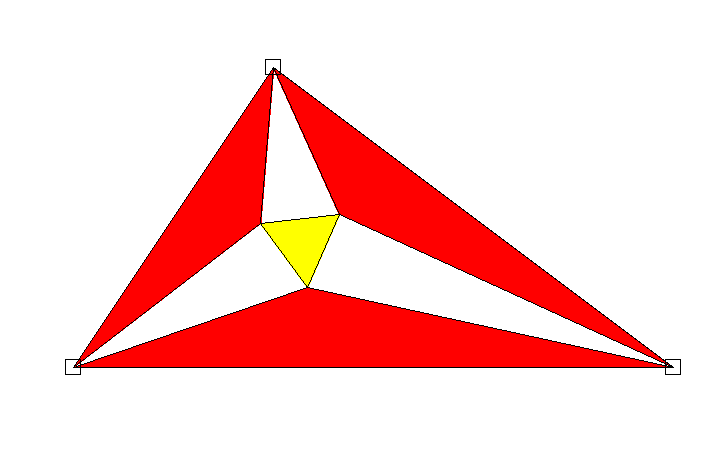

# Morley's trisector theorem

This is an inteactive demonstration of [Morley's trisector theorem](https://en.wikipedia.org/wiki/Morley%27s_trisector_theorem),
which states that "the three points of intersection of the adjacent angle trisectors form an equilateral triangle".

Example output:

  

## Requirements

Python >= 3.10 and the pygame library are required.
